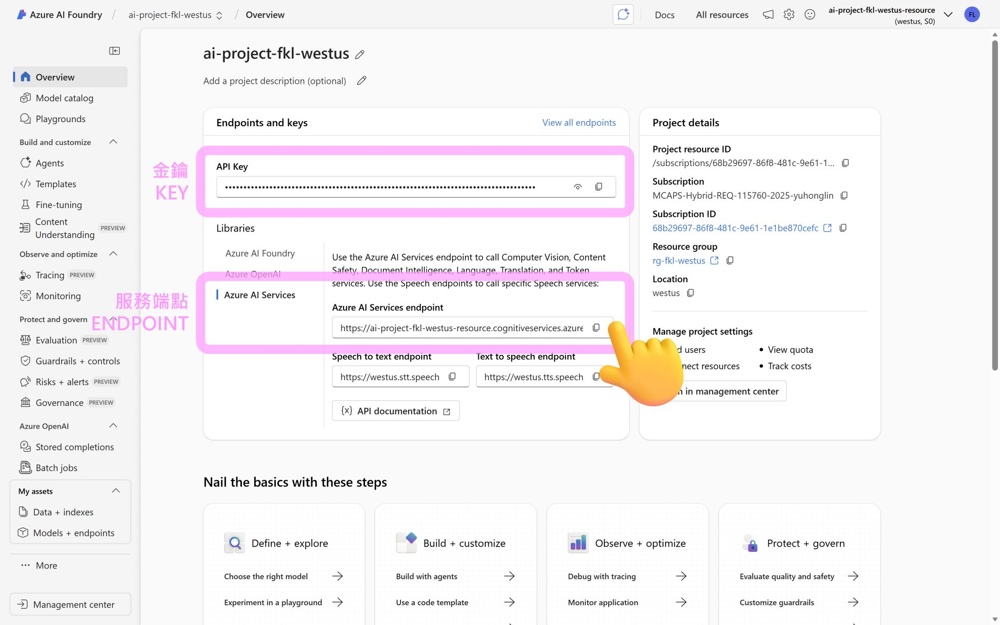

# Azure Content Understanding 分析工具

這是一個使用 Azure Content Understanding API 來分析不同類型媒體檔案的 Python 專案。支援文件、圖片、音訊和影片的內容分析。

## 🚀 功能特色

- 📄 **文件分析** - 分析 PDF 文件，擷取文字、表格和結構化資訊
- 🖼️ **圖片分析** - 分析圖片內容，提供視覺描述和摘要
- 🎵 **音訊分析** - 分析音訊檔案，包含語音轉文字
- 🎬 **影片分析** - 分析影片內容，包含場景分割、關鍵幀擷取和字幕生成

## 📁 檔案結構

```
azure-content-understanding/
├── .env                      # 環境變數設定檔（包含 API 金鑰，不納入版控）
├── .gitignore               # Git 忽略檔案設定
├── pyproject.toml           # Python 專案設定檔
├── README.md                # 專案說明文件
├── analyze_document.py      # 📄 文件分析程式
├── analyze_image.py         # 🖼️ 圖片分析程式
├── analyze_audio.py         # 🎵 音訊分析程式
├── analyze_video.py         # 🎬 影片分析程式
└── output/                  # 分析結果輸出資料夾
    ├── doc_result_*.json    # 文件分析結果
    ├── img_result_*.json    # 圖片分析結果
    ├── audio_result_*.json  # 音訊分析結果
    └── video_result_*.json  # 影片分析結果
```

## 🛠️ 環境需求

- Python 3.8 或更高版本
- uv (Python 套件管理工具)
- Azure Content Understanding API 金鑰

## � 取得 Azure Content Understanding API 金鑰

在開始使用前，您需要先在 Azure AI Foundry Portal 建立 Azure Content Understanding 服務並取得 API 金鑰：

1. 前往 [Azure AI Foundry Portal](https://ai.azure.com/)
2. 建立或選擇您的專案
3. 在左側導覽列中找到 **Content Understanding** 服務
4. 複製 **Endpoint**（端點）和 **Key**（金鑰）



> 💡 **提示**：請妥善保管您的 API 金鑰，不要將其提交到版本控制系統中。

## �📦 安裝步驟

1. **Clone 此專案**
   ```bash
   git clone <repository-url>
   cd azure-content-understanding
   ```

2. **建立虛擬環境並安裝相依套件**
   ```bash
   uv sync
   ```

3. **設定環境變數**
   
   複製 `.env_example` 檔案並重新命名為 `.env`：
   ```bash
   # Windows (PowerShell)
   Copy-Item .env_example .env
   
   # macOS/Linux
   cp .env_example .env
   ```
   
   然後編輯 `.env` 檔案，填入您的 Azure Content Understanding 服務資訊：
   ```properties
   # 請將以下內容替換為您的實際資訊
   ENDPOINT="your-azure-endpoint-here"
   KEY="your-api-key-here"
   ```
   
   其他設定（分析器 ID 和範例檔案 URL）通常不需要修改，除非您想使用自己的檔案。

## 🚀 使用方式

### 分析文件
```bash
uv run python analyze_document.py
```

### 分析圖片
```bash
uv run python analyze_image.py
```

### 分析音訊
```bash
uv run python analyze_audio.py
```

### 分析影片
```bash
uv run python analyze_video.py
```

## 📊 輸出格式

所有分析結果都會儲存為 JSON 格式，檔案命名規則：
- 文件：`doc_result_YYYYMMDD_HHMMSS.json`
- 圖片：`img_result_YYYYMMDD_HHMMSS.json`
- 音訊：`audio_result_YYYYMMDD_HHMMSS.json`
- 影片：`video_result_YYYYMMDD_HHMMSS.json`

結果會同時在終端機顯示（pretty print）並儲存至 `output/` 資料夾。

## 🔧 主要相依套件

- `requests` - HTTP 請求處理
- `python-dotenv` - 環境變數載入

## 📝 程式執行流程

1. **載入環境變數** - 從 `.env` 檔案讀取設定
2. **傳送分析請求** - 使用 POST 請求提交檔案進行分析
3. **輪詢取得結果** - 定期查詢分析狀態，直到完成
4. **格式化輸出** - 在終端機顯示 JSON 格式的結果
5. **儲存結果** - 將結果存為 JSON 檔案

## ⚠️ 注意事項

- 請勿將 `.env` 檔案提交至版本控制系統
- API 金鑰請妥善保管
- 分析大型影片檔案可能需要較長時間
- 確保檔案 URL 可公開存取

## 📄 授權

此專案僅供學習和測試使用。

## 🤝 貢獻

歡迎提交 Issue 或 Pull Request 來改進此專案。

## 📧 聯絡方式

如有問題或建議，請開啟 Issue 討論。
